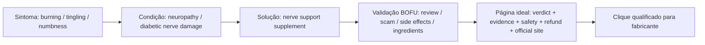
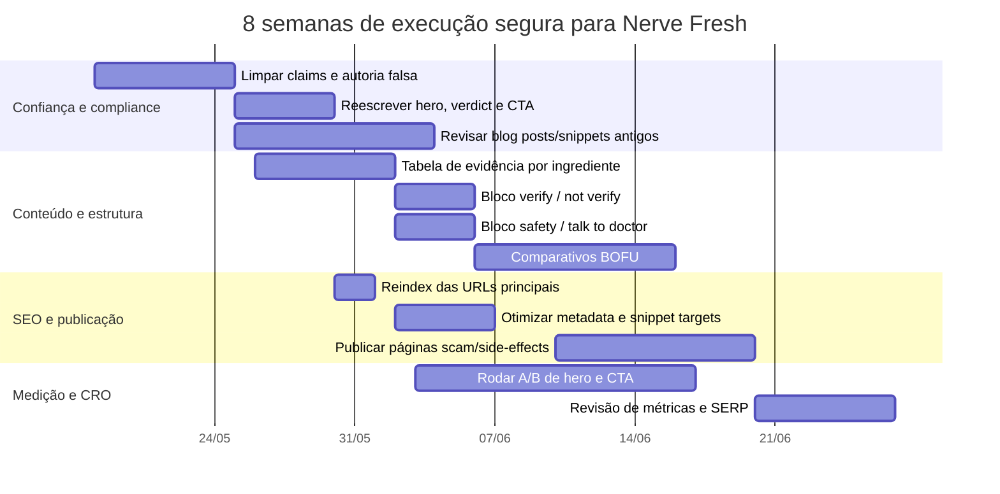

# Estudo Phase 2A de persona, SERP e mensagem para a landing “Nerve Fresh Review”

## Resumo executivo

A oportunidade existe, mas ela não está em “fazer mais hype”. Ela está em **virar o resultado mais confiável de uma SERP extremamente fraca e poluída**. Hoje, o cluster BOFU de Nerve Fresh é dominado por uma mistura de páginas “parasitas” em Google Sites e Scribe, press releases travestidos de review, clones de “site oficial”, posts de Reddit e vídeos de YouTube. Em outras palavras: o padrão competitivo médio é baixo. Isso é bom para você — **desde que** a sua página pareça mais editorial, mais transparente e mais verificável do que todas as outras. citeturn46view0turn46view1turn47view0turn47view1turn47view2turn30search4turn30search8turn45search3

A persona americana provável não é “biohacker” nem jovem. É uma pessoa de **55 a 74 anos**, muitas vezes com diabetes, pré-diabetes ou neuropatia periférica idiopática, cujo problema concreto é: **queimação, formigamento, dormência e dor noturna nos pés/pernas**, piora do sono, medo de perda de mobilidade, tropeços/quedas e frustração com remédios que sedam ou “não resolvem a causa”. NIDDK e CDC descrevem exatamente esse padrão de sintomas — inclusive a piora à noite e o impacto em equilíbrio, sono e risco de lesões nos pés. citeturn53view0turn53view1turn9search6

O problema central da landing atual não é “falta de copy”. É **inconsistência de confiança**. A página principal já mostra sinais de amadurecimento editorial, com trechos mais céticos e moderados. Mas os snippets indexados ainda expõem riscos sérios: “23 studies and 200+ user reports”, “Reviewed by Dr. Sarah Mitchell”, “47-hour independent investigation”, posts de blog que ainda falam em “90-Day Protocol”, “Trustpilot, BBB, and internal surveys” e páginas que sugerem experiência/teste de produto de maneira mais forte do que a prova pública sustenta. Isso cria um descompasso perigoso entre a intenção de “portal editorial” e sinais que lembram advertorial afiliado. citeturn17search0turn20search1turn37search0turn38search0turn38search1turn40search1turn40search2turn39search0

Do ponto de vista de compliance e SEO, o ponto mais importante é este: **eu não consegui verificar publicamente as alegações “23 estudos” nem um universo público próximo de “1,200+ reviews”**. O que foi encontrado sustenta bem menos do que isso: há alguns estudos relevantes sobre ingredientes específicos — sobretudo **dehydrocorybulbine/Corydalis** e **Passiflora**, em contexto majoritariamente pré-clínico — mas não uma bibliografia pública, clara e fechada de 23 estudos sobre a fórmula final. Também encontrei sinais de discussão pública sobre o produto em BBB, Reddit e Mayo Clinic Connect, mas não um lastro público de centenas ou milhares de reviews verificáveis como Trustpilot/Amazon/Walmart em volume robusto. Logo, essas contagens devem ser tratadas como **não verificadas**. citeturn32search0turn32search1turn32search2turn34search1turn34search4turn33search0turn33search11turn42view0turn44search13turn44search16turn41search0

Minha recomendação final é objetiva: **implemente agora as mudanças mínimas seguras de copy e confiança**, peça reindex das páginas críticas, e só então rode o redesign Phase 2B guiado por persona/SERP. Fazer a casa mais “persuasiva” antes de fazê-la mais “confiável” seria atacar o problema errado. O melhor caminho é: **menos tom de investigação heroica, menos números não auditáveis, mais prova, mais contexto, mais segurança, mais linguagem de usuário real 50+**. Isso conversa melhor com o público americano e se alinha melhor com FTC/FDA/Google em um tema YMYL. citeturn50view0turn50view1turn50view2turn50view3turn52view0turn52view1turn51view0turn51view1

## Persona provável, dores e comportamento de busca

A persona principal mais plausível para essa landing é um adulto americano **entre 55 e 74 anos**, às vezes já diagnosticado com diabetes ou neuropatia periférica, às vezes ainda em fase de busca por explicação para sintomas que começaram “nos pés” e estão piorando à noite. Isso não é um chute de marketing: NIDDK diz que a neuropatia periférica ligada ao diabetes tipicamente afeta **pés e pernas**, às vezes mãos e braços, e que **até metade** das pessoas com diabetes pode ter neuropatia periférica. O CDC complementa que a neuropatia periférica é o tipo mais comum de dano nervoso em quem tem diabetes, costuma começar pelos pés e inclui **tingling**, **pain**, **numbness** e sensibilidade aumentada especialmente à noite. citeturn53view0turn53view1

O núcleo emocional dessa persona é mais forte do que a dor isolada. O medo real é perder autonomia. NIDDK descreve perda de equilíbrio, alterações na marcha, maior risco de quedas, dor ao caminhar e feridas nos pés que podem ser percebidas tarde demais; o CDC reforça o medo de úlceras, infecções e até amputação em casos graves. Essa pessoa não está comprando “neurological optimization”. Ela está tentando voltar a dormir, voltar a andar com menos medo e parar de sentir que o corpo “está traindo”. citeturn53view0turn53view1

Em alfabetização em saúde, o cenário é misto, mas pende para o lado de **saúde complexa demais para o formato de advertorial genérico**. O CDC orienta explicitamente que conteúdos digitais para idosos sejam desenvolvidos/testados com adultos mais velhos e lembra que esse público está usando mais internet e redes sociais para buscar saúde. A base histórica de NAAL/AHRQ é ainda mais dura: adultos com 65+ tinham probabilidade maior de estar em níveis **below basic/basic** de health literacy, e entre os grupos mais velhos a limitação é ainda mais acentuada. Isso significa que o texto precisa ser claro, com linguagem concreta, frases curtas, pouca abstração e forte organização visual. citeturn14view0turn16search2turn16search5

Sobre gênero, a melhor leitura não é “só mulheres” ou “só homens”. Os sintomas e a condição atingem ambos. O que muda é o **comportamento de mídia e influência na decisão**. Pew mostra que Facebook e YouTube continuam sendo plataformas com penetração ampla entre faixas etárias mais velhas; entre 50–64 e 65+, no dado de 2025, **YouTube = 85% e 64%**, **Facebook = 74% e 57%**. Mulheres também aparecem mais fortes em Facebook do que homens, o que sugere que parte do tráfego complementar pode vir de esposas, filhas adultas ou cuidadoras pesquisando. citeturn13view0

O comportamento de busca esperado faz um funil muito clássico. A entrada não costuma ser por marca. Começa no sintoma: “burning feet at night”, “tingling in feet”, “numb feet at night”, “neuropathy worse at night”. Só depois a pessoa migra para condição (“peripheral neuropathy”, “diabetic nerve damage”) e então para solução (“nerve support supplement”, “alpha lipoic acid neuropathy”, “Nerve Fresh review”, “Nerve Fresh scam”, “Nerve Fresh side effects”). O dado oficial reforça o hábito digital: o CDC registra que idosos usam a internet com mais frequência para informação de saúde, e a própria AARP destaca que **três quartos dos adultos 40+ que buscam informação de saúde usam o Google**. citeturn14view0turn54view0

Há também um traço decisivo de consumo de suplemento nesse público: ele usa, mas desconfia. AARP encontrou percentuais altos de uso de vitaminas/suplementos em 55–64 e 65+, mas também insegurança sobre conflito com medicamentos, crença exagerada em regulação/governo e preocupação com segurança, pureza e eficácia. Isso é crucial para sua copy: se o site parece “bom demais para ser verdade”, você perde. Se parece cauteloso, específico e honesto sobre limites, você ganha mais confiança. citeturn54view0turn54view1

### Mapa de dores e desejos

| Dimensão | O que a persona sente/pensa | Como isso deve aparecer na mensagem |
|---|---|---|
| Dor física | “Meus pés queimam / formigam / ficam dormentes à noite.” | Use linguagem concreta: “burning”, “pins and needles”, “numbness”, “sleep-disrupting foot pain”. citeturn53view0turn53view1 |
| Dor funcional | “Andar piorou. Tenho medo de cair.” | Traga mobilidade, sono e rotina antes de “nerve restoration”. citeturn53view0 |
| Dor emocional | “Isso está acabando com meu humor e meu sono.” | Fale de dormir melhor e voltar a fazer tarefas simples. NIDDK liga neuropatia crônica a ansiedade/depressão. citeturn53view0 |
| Dor com medicamentos | “Não quero ficar grogue / tonto / dependente.” | Contraste com honestidade: “algumas pessoas buscam opções menos sedativas”, sem prometer equivalência terapêutica. citeturn47view2turn50view0 |
| Medo de golpe | “É mais uma pílula milagrosa?” | Seção “What we could verify / what we could not verify” é essencial. Mayo Clinic Connect mostra ceticismo explícito com “snake oil”. citeturn44search13turn41search17 |
| Desejo prático | “Quero dormir, andar e funcionar melhor.” | Hero e CTA devem focar em avaliar preço, política de reembolso, ingredientes e segurança. |
| Desejo emocional | “Quero sentir que ainda controlo minha vida.” | Mostre escolhas, limites e quando procurar médico — isso aumenta credibilidade. |

### Consultas BOFU prioritárias

As consultas com maior potencial para a sua fase seguinte são:

- `nerve fresh review`
- `nerve fresh scam`
- `nerve fresh complaints`
- `nerve fresh side effects`
- `nerve fresh ingredients`
- `nerve fresh official website`
- `nerve fresh price`
- `nerve fresh refund`
- `nerve fresh vs nerve control 911`
- `burning feet at night supplement`
- `diabetic neuropathy supplement review`

A ordem ideal de priorização continua sendo: **review → scam/legit → side effects → ingredients → official website/price/refund → comparisons**.

## SERP do cluster BOFU e concorrência real

A SERP que importa aqui não é “limpa”. Ela é **volátil, cheia de sobreposição e recheada de conteúdo parasita**. Em vez de listar 50 linhas quase duplicadas, consolidei abaixo o **top-10 recorrente** que aparece atravessando o cluster `review/scam/complaints/ingredients/side effects`. Essa consolidação reflete melhor a realidade operacional: as mesmas páginas aparecem de formas ligeiramente diferentes em várias consultas.

### Top-10 recorrente do cluster BOFU Nerve Fresh

| Posição recorrente | URL | Tipo de site | Título / ângulo | Tamanho e estrutura | CTA / sinais de confiança | Fraquezas principais | Oportunidade para o seu site | Fonte |
|---|---|---|---|---|---|---|---|---|
| 1 | `https://www.the-health-journal.com/` | Editorial afiliado | “Nerve Fresh Review (2026): Is It a Scam? My Honest Result” | Long-form; snippets mostram hero, claims-vs-findings, who should/shouldn’t, side effects, pricing CTA | “Not affiliated with manufacturer”, “47-hour independent investigation”, CTA para preço/disponibilidade | Persistem snippets com “23 studies”, “200+ user reports”, “Dr. Sarah Mitchell”; confiança inconsistente | Você já tem o melhor ângulo possível; precisa só deixar a confiança irrefutável | citeturn17search0turn20search1turn22search0turn24search0turn25search0turn38search0turn39search0turn40search0 |
| 2 | `https://www.the-health-journal.com/blog/nerve-fresh-customer-reviews-2026` | Blog editorial afiliado | “Customer Reviews: A 2026 Sentiment Analysis” | Post de análise/review aggregation | Sinaliza análise de Reddit, Trustpilot, BBB, “internal surveys” | Fontes agregadas não estão publicamente verificáveis; pode soar fabricado | Transformar em metodologia transparente e pública, ou remover números fortes | citeturn40search1turn45search6 |
| 3 | `https://sites.google.com/view/nervefreshreviews2026wetriedit/` | Parasite SEO / Google Sites | “We Tried It / My Honest Review” | Muito longo; seções de ingredientes, side effects, pros/cons, teen guidance, FAQ | CTAs repetidos de ClickBank; tom “gentle wellness” | Fórmula inconsistente, sem autoria real, UX fraca, CTA agressivo, “teen guidance” irrelevante | Fácil de superar com clareza, autoria e evidência real | citeturn45search0turn46view0 |
| 4 | `https://scribehow.com/viewer/Nerve_Fresh_Review_2026_We_Tried_It_for_90_Days__Does_It_Really_Work__KPT0YVEMRuG4LiCufiQIzw` | Parasite SEO / document page | “We Tried It for 90 Days” | Curto, mas com texto genérico e CTA cedo | “Buy official formula here” | Copy extremamente genérica, sem autoria, sem método, sem comparação real | Sua vantagem aqui é enorme com qualquer originalidade honesta | citeturn45search2turn46view1 |
| 5 | `https://www.globenewswire.com/de/news-release/2025/04/04/3056159/0/en/Nerve-Fresh-We-Tested-It-Here-s-Our-Honest-Nerve-Fresh-Review-The-Truth-Revealed.html` | Press release advertorial | “We Tested It — Honest Review” | Muito longo; narrativa de 100+ dias, ingredientes, relatos e FAQ | “Source: Nerve Fresh”, CTA repetido, “verified purchase” quotes | É publicidade com roupagem de review independente | Ganhe em transparência: diga claramente o que é review editorial e o que é afiliado | citeturn47view2 |
| 6 | `https://www.globenewswire.com/news-release/2025/05/07/3076727/0/en/nervefresh-complaints-investigated-2025-user-reviews-tested-verified.html` | Press release advertorial | “Complaints Investigated” | Long-form; complaint handling + verdict | “Source: Nerve Fresh” | Sinal de PR, não de independência | Sua página “scam/legit” pode vencer se for curta, factual e sem dramatização | citeturn41search16turn47view1 |
| 7 | `https://www.accessnewswire.com/newsroom/en/consumer-and-retail-products/nerve-fresh-reviews-2025-ingredients-side-effects-complaints-and-real-1089033` | Press release advertorial | “Ingredients, Side Effects, Complaints and Real Customer Results” | Long-form | “Verified feedback”, “learn more” | Usa discurso de verificação sem prova aberta suficiente | Você pode bater com tabela de evidência + metodologia de fontes | citeturn31search4turn47view0 |
| 8 | `https://www.en-us-en-nervefresh.com/` / `https://usa-nerve-fresh.com/` | Página “oficial” / clones | “Official Website” / ingredientes | Sales page ou clone, foco em compra | “FDA-registered facility”, “GMP”, “60-day guarantee”, “limited-time special” | Múltiplos “official sites”; inconsistência de domínio e até de fórmula em SERP | A sua página precisa ajudar o usuário a checar qual domínio é legítimo hoje | citeturn30search4turn30search8 |
| 9 | `https://www.reddit.com/r/Productivitycafe/comments/1rpl67n/nerve_fresh_reviews_and_complaints_an_honest/` | UGC / Reddit | “Honest Customer 2026 Review” | Relato longo, narrativo | Tom humano; fala de preço, efeito gradual, limitações | Identidade não verificável; pode ser astroturf; link externo para oferta | Você pode “emprestar” a linguagem humana, mas não o modelo testimonial fraco | citeturn45search3 |
| 10 | `https://connect.mayoclinic.org/discussion/neuropathy-pill/` e `https://www.reddit.com/r/Peripheralneuropathy/comments/1pii4vy/has_anyone_here_tried_nerve_fresh_for_nerve/` | Fórum de dúvida / comunidade | Ceticismo e busca por feedback honesto | Curto a médio | Sem CTA; alta confiança contextual | Não resolve decisão de compra sozinho | Sua página deve responder exatamente às dúvidas que esses tópicos levantam | citeturn44search13turn44search16 |

### O que a SERP está te dizendo

O padrão mais valioso aqui é este: **o Google ainda não está premiando, nesse cluster, o melhor “conteúdo de saúde”; está premiando uma mistura de disponibilidade indexável, parasitagem e copy suficientemente relevante para intenção BOFU**. Isso não significa que qualidade não importa — significa que há espaço real para um resultado melhor se ele cumprir o básico técnico e entregar confiança superior. O seu site pode sair na frente não tentando ser “mais forte” do que GlobeNewswire, e sim sendo **mais honesto**, **mais útil** e **mais verificável** do que tudo que está acima. citeturn46view0turn46view1turn47view0turn47view1turn47view2turn52view1

### Comparativo dos cinco competidores mais relevantes

| Concorrente | O que faz melhor hoje | O que faz pior hoje | Como superar |
|---|---|---|---|
| Seu review principal | Ângulo “review + scam + findings” alinhado com BOFU | Sinais residuais de hype/autoria duvidosa | Limpar claims não verificáveis e reforçar transparência |
| Google Sites | Escaneabilidade simples e seções BOFU completas | Zero credibilidade editorial real | Ganhar em autoria, fontes, verdade e UX |
| GlobeNewswire “We Tested It” | Muito completo e persuasivo | Parece press release patrocinado, não review independente | Ser menos promocional e mais útil |
| AccessNewsWire | Cobre todas as objeções de compra | “Verified” sem método transparente | Abrir metodologia e reduzir marketing language |
| Reddit / fóruns | Linguagem humana e dor real | Falta de verificabilidade e alta chance de astroturf | Escrever como pessoa real, mas com método editorial |

### Fluxo ideal de intenção até clique

## Auditoria de linguagem, mensagem e UX da landing atual

A parte boa: o site já tem sinais de correção. O snippet principal hoje já fala em “not a miraculous cure” e “may provide mild support”, o que é **muito melhor** do que claims absolutas. Isso está no caminho certo para um tom editorial mais confiável. citeturn17search0

A parte ruim: a indexação mostra que a limpeza não foi até o fim. O Google ainda associa a página e o blog a elementos problemáticos, como “Reviewed by Dr. Sarah Mitchell”, “23 Studies and 200+ User Reports”, “Trustpilot, BBB, and internal surveys” e até uma recomendação de “Nerve Fresh 90-Day Protocol” em página comparativa. Para um público 50+, isso não aumenta confiança; aumenta a sensação de que o site está “performando autoridade”. citeturn38search0turn38search1turn40search1turn40search2

### Excertos que hoje soam genéricos, artificiais ou pouco confiáveis

| Excerpt atual | Problema | Reescrita recomendada |
|---|---|---|
| “We Investigated Nerve Fresh So You Don't Have To — Here's What 23 Studies and 200+ User Reports Actually Show.” citeturn37search0 | “Investigated” + contagem forte sem prova pública clara. | **“Nerve Fresh Review: what the ingredient evidence suggests, where the claims are strong, and where they are not.”** |
| “Updated February 2026 · 47-hour independent investigation · Not affiliated with manufacturer.” citeturn20search1 | “47-hour investigation” soa roteirizado; “independent” conflita com afiliado se disclosure não estiver colado no hero. | **“Editorial review based on public ingredient research, manufacturer claims, and public user discussions. This page contains affiliate links.”** |
| “Reviewed by Dr. Sarah Mitchell Health Research Analyst” citeturn38search0 | Se a pessoa não é publicamente verificável, isso mina E-E-A-T/FTC. | **“Reviewed by The Health Journal Editorial Team”** ou use uma pessoa real, com bio e credenciais verificáveis. |
| “Who Should (and Shouldn't) Try Nerve Fresh? Nerve Fresh is a specialized tool. It is not a ‘cure-all’...” citeturn24search0 | “Specialized tool” é formulação pouco natural para 50+. | **“Who may consider it — and who should talk to a doctor first”** |
| “The most reported ‘side effect’ is actually intended functionality: Drowsiness.” citeturn25search0 | Parece sofisma de vendas. | **“Because the formula appears calming rather than stimulating, some people may feel sleepy. That may help at night, but it can be a drawback if you are sensitive to sedating herbs or take sleep medication.”** |
| “Check Current Pricing & Availability Secure Manufacturer Checkout.” citeturn26search0 | CTA comercial demais, pouco informativo. | **“See current price, refund terms, and official instructions on the manufacturer site”** |

### H1, subheadline, quick verdict, scam section e CTA

**H1 recomendado**

> **Nerve Fresh Review: what the ingredient evidence suggests, what public feedback looks like, and what I could not verify**

Esse H1 faz três coisas certas ao mesmo tempo: captura a intenção BOFU, baixa o tom de showmanship e introduz transparência sobre limites.

**Subheadline recomendado**

> **If you’re dealing with burning feet, tingling, numbness, or sleep-disrupting nerve discomfort, this page is designed to help you evaluate Nerve Fresh more carefully — including ingredients, safety notes, refund terms, and where the strongest claims overreach the evidence.**

Isso fala a língua da persona, não da marca. Usa as palavras que NIDDK e CDC usam para o quadro clínico real. citeturn53view0turn53view1

**Quick verdict box recomendado**

> **Bottom line:** Nerve Fresh may appeal to adults looking for a plant-based nerve-support supplement, but the public evidence behind the finished formula is limited. I found some ingredient-level research and some public user discussion, but I did **not** find enough public proof to confirm stronger marketing claims like dramatic nerve “repair” or large review counts. If you have diabetes, balance changes, worsening numbness, or foot sores, speak with a clinician first. citeturn53view0turn53view1turn50view0turn50view1

**Scam / legit section recomendada**

> **Is Nerve Fresh a scam?**  
> I did not find evidence that it is an obvious payment scam or fake-store trap. However, I also did not find public evidence strong enough to validate the strongest advertorial claims that appear around the product online. The safest way to judge it is to check four things: ingredient transparency, company/refund details, realistic expectations, and whether the public review footprint is large enough to support the numbers used in marketing. citeturn42view0turn50view2turn50view3

**CTA principal recomendado**

> **See current price, refund policy, and official ordering instructions**

**Nota abaixo do CTA**

> **Affiliate disclosure:** If you purchase through this page, I may earn a commission at no additional cost to you. That does not change my editorial criteria.

Isso conversa melhor com FTC e com a sensibilidade do público mais velho a golpes e conflitos de interesse. FTC insiste em disclosure claro, simples, com a conexão material óbvia e próxima ao endosso. citeturn51view0turn51view1

### Auditoria visual e UX para público 50+

Sem um screenshot confiável do DOM renderizado por JavaScript, a auditoria visual aqui é baseada nos componentes e padrões textuais visíveis nos snippets e no que a SERP deixa claro sobre a estrutura. A conclusão prática é esta: a sua landing precisa operar menos como “editorial dramático” e mais como **checklist de decisão de compra para 50+**.

Para esse público, as recomendações mais fortes são:

1. **Fonte e contraste.** O guia Health Literacy Online recomenda fonte de pelo menos **16 px**, e para muitos usuários idosos considera melhor algo como **19 px/14 pt**. Letras pequenas, contraste fraco e cinzas “soft” reduzem confiança e leitura. citeturn15search13turn14view0turn16search5

2. **Menos blocos narrativos longos, mais módulos escaneáveis.** CDC recomenda design centrado em idosos; em saúde, especialmente, a pessoa quer encontrar rápido: sintomas, ajuda possível, riscos, preço, reembolso, quando falar com o médico. citeturn14view0turn52view1

3. **Trust cues explícitos, não implícitos.** Para 50+, “Reviewed by Dr. X” sem trilha pública pode soar pior do que “Editorial Team”. Melhor: bloco de metodologia, política editorial, data de atualização, disclosure, fontes e link para BBB/empresa quando existir. FTC e Google valorizam clareza de relação comercial e confiança na origem. citeturn51view0turn51view1turn52view1

4. **Imagens verdadeiras ou neutras.** Nada de “médico de banco de imagens” sugerindo validação clínica. Se não houve teste próprio, use produto + ingredientes + telas de reembolso/política com legenda, ou não use “proof-like” imagery. Google recomenda evidência da experiência própria quando houver review experiencial — inclusive visuais próprios. citeturn52view0

5. **CTA menos “checkout”, mais “learn-before-you-buy”.** O público 50+ tende a valorizar clareza e risco reduzido. “See current price and refund terms” converte mais confiança do que “Secure Manufacturer Checkout”.

### Julgamento sobre adequação de linguagem ao público americano

**Parcialmente adequada.** O eixo “review + scam/legit + side effects” encaixa muito bem no comportamento BOFU americano. O problema não é o tema; é a execução. Expressões como “independent investigation”, “23 studies”, “reviewed by Dr. Sarah Mitchell” e claims agregadas de reviews sem trilha pública fazem a página parecer mais com o que o usuário já vê nas páginas spam do que com um editorial maior e mais confiável. Isso precisa mudar. citeturn37search0turn38search0turn46view0turn47view2

## Evidência, fontes e checklist de compliance

### O que foi possível verificar sobre “23 studies” e “1,200+ reviews”

O ponto crucial é separar **evidência de ingrediente**, **evidência de fórmula** e **evidência de experiência de usuários**.

#### Tabela de verificação das fontes

| Claim avaliado | Fonte encontrada | Tipo | O que realmente sustenta | Nível de confiança |
|---|---|---|---|---|
| Corydalis pode ter efeito em dor neuropática | `https://pubmed.ncbi.nlm.nih.gov/24388848/` | PubMed / estudo pré-clínico | Mostra DHCB eficaz contra dor inflamatória e neuropática em modelo experimental; não prova a fórmula final Nerve Fresh em humanos | Alto para o composto, baixo para o produto citeturn32search2 |
| DHCB / Corydalis após lesão nervosa | `https://pubmed.ncbi.nlm.nih.gov/30622226/` | PubMed / estudo pré-clínico | Reforça analgesia de dehydrocorybulbine em neuropathic pain | Alto para o composto, baixo para o produto citeturn32search0 |
| Passiflora e alodinia neuropática | `https://pubmed.ncbi.nlm.nih.gov/26912265/` | PubMed / pré-clínico | Sugere utilidade potencial de *Passiflora incarnata* em modelo de neuropathic allodynia | Médio; ainda não valida a fórmula comercial em humanos citeturn32search1 |
| California poppy com ação sedativa/analgésica | `https://pubmed.ncbi.nlm.nih.gov/1680240/` e `https://pubmed.ncbi.nlm.nih.gov/11507727/` | PubMed | Apoia tradição/efeito neurofisiológico e sedativo; não é prova clínica de neuropatia periférica do produto | Médio-baixo para neuropatia do produto citeturn34search1turn34search4 |
| Marshmallow root anti-inflamatório/antioxidante | `https://pubmed.ncbi.nlm.nih.gov/32256361/` e `https://pubmed.ncbi.nlm.nih.gov/21281251/` | PubMed | Dá base anti-inflamatória geral; não valida neuropatia periférica em humanos para Nerve Fresh | Médio-baixo citeturn33search0turn33search11 |
| Opuntia / prickly pear antioxidante | `https://pubmed.ncbi.nlm.nih.gov/22285760/` | PubMed | Base antioxidante geral, sem prova direta da fórmula em neuropatia humana | Baixo para o produto citeturn33search2 |
| Sintomas e night pain são plausíveis para a persona | NIDDK + CDC | Órgão oficial | Confirma burning/tingling/numbness, piora à noite, risco funcional | Alto citeturn53view0turn53view1 |
| Existe alguma review pública ligada à empresa/produto | BBB Premier Vitality LLC | BBB | Há pelo menos um review BBB mencionando Nerve Fresh; isso não chega perto de “large review footprint” | Médio para existência de feedback, baixo para volume citeturn42view0 |
| Existe discussão pública em fóruns | Mayo Clinic Connect + Reddit | Fóruns | Confirma que há discussão pública e dúvidas/reviews, mas em volume pequeno e difícil de auditar | Médio-baixo citeturn44search13turn44search16turn45search3 |
| “1,200+ reviews” ou mesmo “200+ user reports” são verificáveis publicamente | Trustpilot/BBB/Reddit pesquisados | Trust signals externos | Não encontrei lastro público suficiente para sustentar esse número com confiança | **Não verificado** citeturn40search1turn41search0turn42view0turn44search16 |
| “23 studies” sobre a fórmula final | Bibliografia pública fechada | Metodologia | Não encontrei bibliografia pública e transparente que feche essa conta para a fórmula final | **Não verificado** citeturn32search0turn32search1turn32search2turn33search0turn34search1 |

### Conclusão sobre a verificação

A conclusão mais rigorosa é a seguinte: **há algum suporte científico para partes isoladas da narrativa de ingredientes**, principalmente em nível pré-clínico, mas **não há base pública suficiente para dizer “23 studies validate Nerve Fresh”**. Da mesma forma, **não há footprint público verificável para “1,200+ reviews”**; e mesmo “200+ user reports”, embora mais plausível em tese, não está publicamente demonstrado por páginas, planilhas, metodologia de coleta e deduplicação. Portanto, ambas as expressões devem ser removidas ou radicalmente requalificadas. citeturn32search0turn32search1turn32search2turn42view0turn44search13turn44search16

### Checklist de compliance FTC, FDA e Google

Do ponto de vista regulatório e de plataforma, os riscos não são abstratos.

A FDA diferencia claramente **structure/function claims** de **disease claims**. Você pode falar que um ingrediente ajuda a manter certa função normal do corpo, mas a rotulagem/marketing não pode declarar que o suplemento “diagnoses, treats, cures, or prevents” disease; esse disclaimer é mandatório e a linha entre estrutura/função e doença não é cosmética. citeturn50view0

A FTC exige que claims objetivos de benefícios/segurança de produtos de saúde sejam **truthful, not misleading, and supported by competent and reliable scientific evidence**; e o guidance deixa explícito que isso vale também para internet, influenciadores, press releases e outros formatos promocionais. citeturn50view1

Desde outubro de 2024, a regra da FTC sobre reviews e testimonials está mais dura: proíbe fake reviews, reviews de pessoas sem experiência real, uso enganoso de insiders, company-controlled review sites fingindo independência e afins. Isso atinge em cheio qualquer tentativa de persona falsa, review sintético não identificado ou “portal independente” que, na prática, só controlaria narrativas do produto. citeturn50view2turn50view3

No campo do Google, o alinhamento é igualmente claro: conteúdo YMYL precisa parecer confiável; páginas de review deveriam mostrar experiência, pesquisa original, diferenciação frente a concorrentes, prós e contras e, quando houver experiência própria, evidência visual ou quantitativa. Além disso, links pagos/devem ser qualificados com `rel="sponsored"`; `nofollow` continua aceitável, mas `sponsored` é preferível. citeturn52view0turn52view1turn52view2

### Formulações que devem ser evitadas agora

Evite imediatamente frases do tipo:

- “reverses neuropathy”
- “repairs nerve damage”
- “eliminates burning, tingling and numbness”
- “doctor-tested on...”
- “clinically proven” sem ensaio do produto
- “4.8/5 based on 1,200+ reviews” sem trilha pública
- “23 studies show...” sem bibliografia aberta e consistente
- “independent investigation” se o disclosure afiliado não estiver colado no hero
- “reviewed by Dr. Sarah Mitchell” se não houver identidade e credenciais verificáveis
- “non-drowsy / no side effects” se a própria fórmula inclui componentes calmantes/sedativos ou se você não tem base robusta

## Estrutura recomendada, backlog priorizado e recomendação final

### Nova estrutura de página recomendada

A melhor versão desta landing, para esse público e essa SERP, não é “mais longa”. É **mais confiável e mais escaneável**.

A estrutura ideal seria:

1. **Hero honesto e claro**  
   H1 + subheadline + disclosure afiliado + atualização editorial + CTA informativo.

2. **Quick verdict box**  
   3 bullets: para quem pode fazer sentido, principais limites da evidência, quando falar com médico.

3. **Symptoms this page is built for**  
   Burning feet at night, tingling, numbness, sleep disruption, mild-to-moderate discomfort.

4. **Ingredient evidence table**  
   Ingrediente | o que a marca sugere | o que encontrei em pesquisa pública | nível de evidência | nota de segurança.

5. **What I could verify vs what I could not verify**  
   Remédio direto contra hype.

6. **Public feedback snapshot**  
   Metodologia curta e transparente: BBB, Reddit, Mayo/fora de plataformas grandes, ausência de robusto Trustpilot profile, sem números absolutos inflados.

7. **Price, refund, official ordering info**  
   CTA com expectativa certa: preço, política de reembolso, envio, domínio oficial atual.

8. **Who should consider it / who should see a doctor first**  
   Especialmente diabetes, perda de sensibilidade, feridas nos pés, alterações de marcha.

9. **Alternatives / comparisons**  
   Nerve Fresh vs suplementos com ALA/B-vitamins; vs Nerve Control 911; vs “do nothing”.

10. **FAQ + source notes + editorial policy**  
    Encerramento de confiança.

### Backlog priorizado

| Prioridade | Entregável | Esforço | Critério de aceite |
|---|---|---|---|
| Máxima | Remover/reescrever “23 studies”, “200+ reports”, “1,200+ reviews”, “independent investigation”, “Dr. Sarah Mitchell” onde não houver prova pública | Baixo | Nenhum snippet/sitewide index mostra contagens não verificadas ou autora falsa |
| Máxima | Inserir disclosure afiliado curto no hero e ao lado do CTA principal | Baixo | Disclosure visível sem scroll em desktop e mobile |
| Máxima | Reescrever CTA principal para foco informativo | Baixo | CTA deixa claro preço + refund + official instructions |
| Máxima | Criar bloco “What I could verify / What I could not verify” | Médio | Bloco aparece acima da primeira CTA longa |
| Alta | Criar tabela de evidência por ingrediente | Médio | Cada ingrediente possui evidência/safety/maturity level |
| Alta | Criar bloco “when to talk to a doctor first” | Baixo | Cita diabetes, foot sores, worsening numbness, balance changes |
| Alta | Revisar todas as páginas de blog indexadas com snippets antigos (“90-Day Protocol”, “internal surveys”, “Dr. Sarah”) | Médio | Search snippets começam a refletir a nova política editorial |
| Alta | Atualizar autoria do site todo para pessoa real ou Editorial Team + páginas About, Editorial Policy, Medical Disclaimer | Médio | Cada página tem byline e política consistentes |
| Média | Adicionar comparação curta com concorrentes/alternativas | Médio | Usuário entende diferenciais sem precisar voltar à SERP |
| Média | Refinar FAQ visível e schema apenas para perguntas realmente exibidas | Baixo | FAQ condiz 100% com conteúdo visível |
| Média | Reindex no Search Console após mudanças críticas | Baixo | URLs principais enviadas e rastreadas |
| Longo prazo | Produzir evidência própria legítima: compra do produto, fotos reais, timeline honesta de uso, sem alegações além do observado | Alto | Material first-hand com legenda e método claros |

### Ideias de testes A/B e KPIs

| Teste | Variante A | Variante B | KPI principal | KPI secundário |
|---|---|---|---|---|
| Hero | foco em “review + evidence” | foco em “burning feet/night pain” | CTR no hero CTA | scroll 50% |
| CTA principal | “See current price, refund policy...” | “Check current pricing & availability” | `affiliate_click / session` | tempo na página |
| Quick verdict | logo abaixo do hero | após seção de sintomas | scroll 75% | engaged sessions |
| Ordem de blocos | ingrediente primeiro | public feedback primeiro | `affiliate_click` | bounce/engagement rate |
| Scam section | título “Is it a scam?” | título “What I could verify” | click depth | tempo médio |
| Comparison box | com “alternatives” cedo | sem alternatives | outbound CTR | retorno à SERP estimado |

Os KPIs a acompanhar nos próximos 30 dias devem ser:

- **GSC impression share / average position** nas consultas de marca e BOFU
- **Organic CTR** por página
- **`affiliate_click rate`**
- **scroll 50 / 75 / 90**
- **engaged sessions**
- **tempo médio**
- **hops no ClickBank**
- **SERP snippet drift** após reindex

### Mudanças mínimas seguras para fazer agora

Aqui está a lista mais importante do relatório: **o mínimo que eu mudaria imediatamente, antes de qualquer redesign completo**.

**Trocar:**

> “We Investigated Nerve Fresh So You Don't Have To — Here's What 23 Studies and 200+ User Reports Actually Show.”

**Por:**

> **Nerve Fresh Review: what the ingredient evidence suggests, what public feedback looks like, and what I could not verify**

**Trocar:**

> “Updated February 2026 · 47-hour independent investigation · Not affiliated with manufacturer.”

**Por:**

> **Updated May 2026 · Editorial review based on public ingredient research, manufacturer claims, and public user discussions · This page contains affiliate links**

**Trocar:**

> “Reviewed by Dr. Sarah Mitchell”

**Por:**

> **Reviewed by The Health Journal Editorial Team**  
> ou por uma pessoa real, verificável, com página de autor.

**Trocar:**

> “The most reported ‘side effect’ is actually intended functionality: Drowsiness.”

**Por:**

> **Some users may feel sleepy because the formula appears calming rather than stimulating. That may be useful at night, but it may be a drawback for people sensitive to sedating herbs or already using sleep medication.**

**Trocar CTA:**

> “Check Current Pricing & Availability Secure Manufacturer Checkout”

**Por:**

> **See current price, refund policy, and official ordering instructions**

**Adicionar logo abaixo do CTA:**

> **Affiliate disclosure: If you buy through this page, I may earn a commission at no extra cost to you.**

### Linha do tempo recomendada para as próximas oito semanas

### Recomendação final

Minha recomendação é **retomar o projeto, sim**, mas pela rota correta. Não pela rota de “mais promessas”, nem pela rota de “encher de blog post sem critério”. Retomar porque a SERP está fraca e porque o seu ângulo de review editorial tem espaço real. Mas retomar com uma tese operacional muito clara:

- **fase imediata:** limpar confiança, claims e autoria;
- **fase seguinte:** reestruturar a landing para público 50+ e BOFU;
- **fase posterior:** expandir com páginas “scam”, “side effects”, “ingredients”, “official website”, “refund” e comparativos.

Se você fizer só a Fase 1 técnica/compliance, melhora risco, mas não necessariamente ranking de forma material. Se fizer só redesign/copy sem limpar claims e snippets antigos, melhora aparência, mas preserva o problema de confiança. O ganho real deve vir da combinação dos dois. Isso, além de ser melhor para o usuário, é mais alinhado com FTC/FDA/Google em YMYL. citeturn50view0turn50view1turn50view2turn51view0turn52view0turn52view1

### Limitações e perguntas em aberto

A principal limitação metodológica foi técnica: como a landing é renderizada de forma dinâmica, eu não consegui extrair o DOM completo e fazer uma auditoria pixel-perfect da versão live com o mesmo nível de detalhe que consegui para alguns concorrentes. Por isso, a seção visual/UX foi construída com base em snippets indexados, estrutura observável e padrões textuais públicos, não em medição CSS linha por linha.

Também permanece aberta a pergunta prática mais importante do projeto: **qual é o domínio “oficial” realmente estável do fabricante hoje**, já que a SERP mostra múltiplos domínios “official”. Isso precisa ser resolvido editorialmente na página com uma checagem manual contínua antes de escalar.