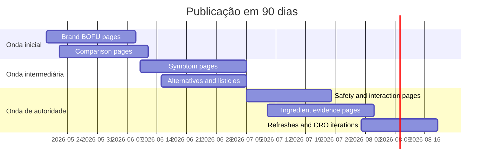

# Plano profissional de SEO para dominar Google com Nerve Fresh no mercado dos EUA

## Resumo executivo

A oportunidade existe porque a SERP de **Nerve Fresh** está fraca, fragmentada e pouco confiável. Hoje ela mistura páginas “oficiais” conflitantes, artigos patrocinados, PDFs parasitas, vídeos pouco úteis e reviews com claims agressivas. Há inclusive inconsistência pública entre páginas que se apresentam como oficiais sobre **preço, garantia, ratings e promessas**, o que naturalmente gera demanda por buscas como *review*, *scam*, *side effects*, *ingredients* e *official website*. Isso abre espaço para um ativo editorial mais confiável, comparativo e transparente do que a média do mercado. citeturn1view0turn1view1turn1view2turn10search17turn17search7

O melhor caminho não é depender só do termo “Nerve Fresh review”. O caminho profissional em 2026 é construir um **ecossistema de intenção** em três frentes: **captura de marca** (review, scam, side effects, ingredients, preço, oficial), **captura de dor/sintoma** (burning, tingling, numbness, night symptoms, foot nerve pain) e **captura de solução/evidência** (ingredients, supplement comparisons, interaction risk, evidence summaries). Isso conversa diretamente com a persona 50+, que sofre com queimação/formigamento/dormência, tende a pesquisar à noite, receia efeitos colaterais de remédios como gabapentin/pregabalin e é atraída por alternativas menos sedativas, mas com forte necessidade de prova e segurança. Sintomas noturnos e sensoriais são muito típicos de neuropatia periférica, e preocupação com interações entre suplementos e medicamentos é especialmente relevante em adultos mais velhos. citeturn2search0turn2search1turn2search17turn31search0turn31search2turn20search2turn24view1

Ao mesmo tempo, o nicho exige disciplina máxima de compliance. Google pede conteúdo útil, confiável e feito para pessoas; recomenda reviews com evidência, experiência demonstrável e diferenciação real. FTC e FDA pressionam fortemente o mercado de suplementos: claims de saúde precisam de base científica adequada, reviews/testemunhos falsos são proibidos e suplementos não são “FDA approved” por padrão. Além disso, em maio de 2026, o próprio Google deixou explícito que as políticas anti-spam também se aplicam a tentativas de manipular respostas generativas em AI Overviews/AI Mode. citeturn5search0turn5search1turn24view2turn4search0turn18search3turn22search3turn22search8turn29search2turn5search2

Partindo do estado atual que você informou — **home já refatorada como review editorial**, **blog limpo**, **canonical/sitemap/robots ajustados** e **tracking básico implementado** — eu não considero a Fase 3 como um “refactor do zero”. Eu considero como a fase de **expansão estratégica**. A base já existe; o que falta agora é transformar o site num **hub de confiança e decisão** para o buyer norte-americano. Em termos simples: menos “landing page isolada”, mais **máquina editorial com intenção comercial organizada**.

Minha recomendação central é esta:

- **Nos próximos 90 dias**, publicar primeiro páginas BOFU de marca e comparação, depois páginas de dor/sintoma, e por fim páginas de evidência/autoridade.
- **Migrar de SPA pura para SSR/SSG** assim que possível, porque Google renderiza JavaScript, mas continuar dependente de CSR para metadata/canonical é desnecessariamente arriscado quando o objetivo é dominar uma SERP competitiva e YMYL. citeturn28search0turn28search1turn6search1
- Criar um **Evidence Database** interno que abasteça todas as páginas com a mesma linguagem de prova, limitação, segurança e evidência.
- Medir tudo com uma cadeia completa: **GSC + GA4 + ClickBank unique hops / order form impressions / sales**, porque ClickBank hoje já expõe métricas de *unique hops* e *unique order form impressions*, o que permite ligação real entre SEO, CTR, cliques afiliados e venda. citeturn23search2turn23search8turn23search15

Se a execução for boa, o objetivo não deve ser “rankeio de 1 página”. O objetivo deve ser **controlar a jornada inteira**: a pessoa entra por sintoma, segurança, comparação ou review de marca, encontra prova honesta, entende limitações, se sente segura, clica no afiliado e volta depois para consultas relacionadas. Isso é como se domina Google nesse nicho em 2026.

## Diagnóstico estratégico do mercado e das restrições

O mercado de “nerve support” nos EUA já tem dois tipos claros de concorrente. O primeiro tipo é o **brand-claim product page**: páginas de marca ou clones promocionais que prometem alívio, usam ingredientes botânicos, ratings inflados e linguagem de “official site”. O segundo tipo é o **medical explainer / supplement listicle**: páginas de publishers e sites médicos que capturam intenção informacional alta, especialmente em sintomas, causas e alternativas. Nerve Fresh e Nerve Control 911 pertencem ao primeiro grupo; Nervive e Nerve Renew já ocupam terreno mais organizado com formulações mais convencionais baseadas em **ALA, vitaminas B, benfotiamina e methylcobalamin**, o que torna comparações muito fortes do ponto de vista de decisão de compra. citeturn1view1turn35search0turn34view0turn34view1turn21search2

Isso importa porque a sua vantagem não é parecer mais agressivo do que os players ruins. Sua vantagem é parecer **mais crível, mais legível e mais útil** do que todos eles. O Google vem insistindo que quer conteúdo útil, confiável e orientado ao usuário, e suas orientações específicas para reviews enfatizam conhecimento real, evidência, comparação, medição e explicação do que diferencia um produto dos concorrentes. Esse ponto é decisivo no seu caso: um review honesto com limites claros e comparação real tende a ser mais forte do que uma cópia de VSL em formato de artigo. citeturn5search0turn5search1turn28search2

A persona também está muito clara. A dor central é neuropatia periférica ou um quadro percebido como tal: **burning, tingling, numbness, pins & needles, weakness, worse at night**. Essa pessoa costuma associar o problema a envelhecimento, diabetes, circulação, deficiência vitamínica ou “inflamação/nervos”, e frequentemente já passou por ou conhece medicamentos com perfis de sonolência, tontura e dificuldade cognitiva. Mayo e Medline destacam exatamente esses efeitos para gabapentin/pregabalin, e o NCCIH reforça que suplementos e ervas podem interagir com medicações, o que significa que o conteúdo vendedor precisa sempre equilibrar expectativa com segurança. citeturn2search0turn2search1turn2search2turn31search0turn31search1turn31search2turn24view1

No lado regulatório, esse nicho não perdoa improviso. FTC deixa claro que anúncios de produtos de saúde precisam ser verdadeiros, não enganosos e suportados por ciência adequada; o guia de 2022 elevou o padrão para claims de benefício e segurança. A FTC também finalizou a regra contra reviews e testemunhos falsos em 2024. Já a FDA deixa explícito que **suplementos não são aprovados antes da venda**, e que dizer “FDA approved” para suplemento é enganoso; além disso, registro de instalações não significa aprovação do produto. Isso precisa virar regra editorial fixa do projeto. citeturn24view2turn18search13turn4search0turn22search3turn22search8turn22search2

Em termos de Google 2026, há dois pontos que mudam sua execução. O primeiro é que **SEO tradicional continua sendo a base do AI Search**, segundo o novo guia oficial de otimização para recursos generativos do Google, publicado em maio de 2026. O segundo é que Google já colocou na política de spam que tentar manipular respostas generativas também é spam. Em outras palavras: o caminho não é “GEO hack”; o caminho é criar páginas tão úteis, estruturadas e citáveis que elas sejam **fontes elegíveis** tanto para ranking clássico quanto para citações em AI Overviews/AI Mode. citeturn5search2turn5search6turn29search2

A arquitetura estratégica recomendada é esta:

```mermaid
flowchart TD
    A[Home - Nerve Fresh Review] --> B[Brand hub]
    A --> C[Symptom hub]
    A --> D[Evidence hub]
    A --> E[Comparison hub]

    B --> B1[Nerve Fresh side effects]
    B --> B2[Nerve Fresh ingredients]
    B --> B3[Nerve Fresh scam or legit]
    B --> B4[Nerve Fresh price and refund]
    B --> B5[Official website guide]

    C --> C1[Burning feet at night]
    C --> C2[Tingling feet at night]
    C --> C3[Numb toes causes]
    C --> C4[Neuropathy symptoms at night]
    C --> C5[Foot nerve pain at night]

    D --> D1[Passionflower evidence]
    D --> D2[Corydalis evidence]
    D --> D3[Prickly pear evidence]
    D --> D4[Marshmallow root evidence]
    D --> D5[California poppy evidence]

    E --> E1[Nerve Fresh vs Nerve Control 911]
    E --> E2[Nerve Fresh vs Nervive]
    E --> E3[Nerve Fresh vs Nerve Renew]
    E --> E4[Best nerve support supplements]
    E --> E5[Nerve Fresh alternatives]
```



Essa arquitetura faz três coisas ao mesmo tempo: captura tráfego BOFU de marca, constrói topical authority em sintoma e ancora confiança com prova e comparação. É exatamente isso que um projeto profissional faria.

## Universo de palavras-chave e mapa de SERP

### Universo de palavras-chave por cluster

A priorização abaixo foi pensada para o mercado dos EUA, sem volume fechado, porque o ideal é você cruzar esta lista com o Keyword Planner logo depois. A classificação usa: **intent** (informacional ou comercial), **funnel**, **tipo de página**, **prioridade** e **risco YMYL**.

### Cluster de marca e decisão de compra

| Keyword | Intent | Funnel | Tipo recomendado | Prioridade | Risco YMYL |
|---|---|---:|---|---|---|
| nerve fresh review | Comercial-investigativo | BOFU | Review editorial principal | P1 | Alto |
| nerve fresh scam | Comercial-investigativo | BOFU | Scam-or-legit page | P1 | Alto |
| nerve fresh side effects | Comercial-investigativo | BOFU | Safety page | P1 | Alto |
| nerve fresh ingredients | Comercial-investigativo | BOFU | Ingredients overview | P1 | Alto |
| nerve fresh complaints | Comercial-investigativo | BOFU | Complaints / public feedback page | P1 | Alto |
| nerve fresh price | Comercial | BOFU | Price / bundles / refund page | P1 | Médio |
| nerve fresh official website | Comercial | BOFU | Where to buy safely | P1 | Médio |
| does nerve fresh work | Comercial-investigativo | BOFU | Evidence-based verdict page | P1 | Alto |
| nerve fresh refund policy | Comercial | BOFU | FAQ / policy page | P2 | Médio |
| nerve fresh customer reviews | Comercial-investigativo | BOFU | Public sentiment page | P1 | Alto |

### Cluster de comparação

| Keyword | Intent | Funnel | Tipo recomendado | Prioridade | Risco YMYL |
|---|---|---:|---|---|---|
| nerve fresh vs nerve control 911 | Comercial-investigativo | BOFU | Comparison page | P1 | Alto |
| nerve fresh vs nervive | Comercial-investigativo | BOFU | Comparison page | P1 | Alto |
| nerve fresh vs nerve renew | Comercial-investigativo | BOFU | Comparison page | P1 | Alto |
| nerve fresh alternatives | Comercial-investigativo | BOFU | Alternatives page | P1 | Alto |
| best nerve support supplements | Comercial-investigativo | MOFU/BOFU | Editorial listicle | P1 | Alto |
| best supplements for neuropathy | Comercial-investigativo | MOFU/BOFU | Editorial listicle | P1 | Alto |
| nerve control 911 vs nervive | Comercial-investigativo | BOFU | Comparison page | P2 | Alto |
| nerve renew vs nervive | Comercial-investigativo | BOFU | Comparison page | P2 | Alto |

### Cluster de sintoma e problema

| Keyword | Intent | Funnel | Tipo recomendado | Prioridade | Risco YMYL |
|---|---|---:|---|---|---|
| burning feet at night | Informacional | TOFU/MOFU | Symptom explainer + pathways | P1 | Alto |
| tingling feet at night | Informacional | TOFU/MOFU | Symptom explainer | P1 | Alto |
| pins and needles in feet at night | Informacional | TOFU/MOFU | Symptom explainer | P1 | Alto |
| foot nerve pain at night | Informacional | TOFU/MOFU | Symptom explainer | P1 | Alto |
| neuropathy symptoms at night | Informacional | TOFU/MOFU | Symptom explainer | P1 | Alto |
| burning feet and tingling | Informacional | TOFU/MOFU | Symptom explainer | P2 | Alto |
| numb toes causes | Informacional | TOFU/MOFU | Causes page | P1 | Alto |
| numb feet causes in older adults | Informacional | TOFU/MOFU | Age-specific causes page | P2 | Alto |
| why do my feet burn at night | Informacional | TOFU/MOFU | Symptom Q&A | P2 | Alto |
| nerve pain in feet causes | Informacional | TOFU/MOFU | Causes page | P2 | Alto |

### Cluster de solução e ingredientes

| Keyword | Intent | Funnel | Tipo recomendado | Prioridade | Risco YMYL |
|---|---|---:|---|---|---|
| supplements for nerve support | Informacional-comercial | MOFU | Educational buyer guide | P1 | Alto |
| natural nerve support | Informacional-comercial | MOFU | Buyer guide | P1 | Alto |
| corydalis for nerve pain | Informacional | MOFU | Ingredient evidence page | P2 | Alto |
| passionflower for sleep | Informacional | MOFU | Ingredient evidence page | P2 | Médio |
| prickly pear benefits | Informacional | TOFU/MOFU | Ingredient evidence page | P2 | Médio |
| marshmallow root benefits | Informacional | TOFU/MOFU | Ingredient evidence page | P2 | Médio |
| california poppy supplement | Informacional-comercial | MOFU | Ingredient evidence page | P2 | Médio |
| alpha lipoic acid for neuropathy | Informacional-comercial | MOFU | Evidence page / comparison support | P1 | Alto |
| benfotiamine for neuropathy | Informacional-comercial | MOFU | Evidence page / comparison support | P1 | Alto |
| methylcobalamin for nerve health | Informacional-comercial | MOFU | Evidence page / comparison support | P2 | Alto |

### Cluster de segurança, prova e risco

| Keyword | Intent | Funnel | Tipo recomendado | Prioridade | Risco YMYL |
|---|---|---:|---|---|---|
| nerve support supplement side effects | Informacional-comercial | MOFU | Safety guide | P1 | Alto |
| supplement interactions with gabapentin | Informacional | MOFU | Interaction guide | P1 | Alto |
| supplement interactions with warfarin | Informacional | MOFU | Interaction guide | P2 | Alto |
| are supplements FDA approved | Informacional | TOFU/MOFU | Compliance explainer | P2 | Alto |
| neuropathy supplement scam | Comercial-investigativo | BOFU | Scam checklist page | P1 | Alto |
| fake supplement reviews | Informacional | TOFU/MOFU | Trust guide | P2 | Médio |
| supplement quality certifications meaning | Informacional | TOFU/MOFU | Compliance explainer | P3 | Médio |
| FDA registered facility meaning | Informacional | TOFU/MOFU | Compliance explainer | P2 | Médio |

Esses clusters seguem exatamente o que Google favorece hoje: conteúdo útil, confiável, people-first, com foco claro em necessidades do usuário, e reviews que realmente ajudem alguém a decidir. citeturn5search0turn5search1turn28search2

### Leitura estratégica das SERPs

A amostragem das SERPs indica cinco padrões. Primeiro, **o cluster de marca está contaminado** por clones “official”, PDFs parasitas, PR syndication e reviews com linguagem agressiva. Segundo, **o cluster de sintoma é dominado por publishers médicos e sites institucionais**, o que eleva a barra de credibilidade, mas deixa espaço para páginas que façam a ponte entre sintoma, decisão de compra segura e “quando procurar avaliação médica”. Terceiro, **o cluster de comparação está relativamente aberto**, especialmente quando a comparação é específica e bem estruturada. Quarto, **o cluster de solução/ingrediente** favorece ativos educativos e resumos de evidência, não VSLs disfarçadas. Quinto, **o cluster de segurança/interação** é um dos mais promissores para confiança e diferenciação, justamente porque concorrentes afiliados quase nunca fazem isso bem. citeturn1view0turn1view1turn1view2turn17search0turn16search0turn16search3turn16search7turn2search0turn20search2turn24view1

Abaixo está a síntese estratégica dos **30 termos prioritários**. Para branded queries, a observação é necessariamente mais direcional, porque essas SERPs são instáveis e poluídas; para sintoma/segurança, a observação é mais estável. **Valide manualmente em navegador US incognito antes da execução final de titles/H1s.**

### SERP analysis dos 30 termos prioritários

| Keyword | SERP features e formatos dominantes | Top concorrentes observados | Gap / oportunidade |
|---|---|---|---|
| nerve fresh review | reviews, PDFs, vídeos, Reddit, official clones | get-nervefresh.com; en-us-en-nervefresh.com; Globenewswire Nerve Fresh review; Reddit thread; YouTube review | vencer com review limpo, comparativo, sem persona falsa |
| nerve fresh scam | scam/legit articles, PR, cloned official pages | Globenewswire complaints article; sites.google.com review; ScribeHow review; Reddit; official clones | página “Scam or Legit” objetiva, com checklist de confiança |
| nerve fresh side effects | ingredients PDFs, cloned sales pages, review posts | assets.ctfassets PDF; official clones; Google Sites review; YouTube; editorial safety page | criar página de side effects + interactions + who shouldn’t buy |
| nerve fresh ingredients | official pages e PDFs | en-us-en-nervefresh.com; get-nervefresh.com; Scribd copy; Google Sites; your ingredients page | ingredients page com evidence matrix vence por clareza |
| nerve fresh complaints | SERP ruidosa, baixa qualidade | PR syndication; Reddit; Google Sites; YouTube; official clones | complaints page com “what we could verify / could not verify” |
| nerve fresh price | official clones e order pages | en-us-en-nervefresh.com; ClickBank-style official pages; cloned offer pages; Scribd copies; PR | price page com bundles + refund + why official only |
| nerve fresh official website | official clones e clones شبه-oficiais | get-nervefresh.com; usa-nerve-fresh.com; en-us-en-nervefresh.com; godaddysite clone; Scribd copy | page “how to buy safely” é muito necessária |
| does nerve fresh work | review pages e PR | Globenewswire review; Reddit 90-day thread; official clones; Sites review; YouTube | responder com framework de evidência, não promessa |
| nerve fresh vs nerve control 911 | comparison + official product pages | the-health-journal.com; phytagelaboratories.com; Amazon Nerve Control 911; Globenewswire complaints article; Scribd | já há vantagem: ampliar e reforçar essa página |
| nerve fresh vs nervive | brand vs retail comparison | Nervive official; Nerve Fresh clones; Mayo/Healthline supplement pages; Amazon listings; your future comparison | oportunidade alta porque quase ninguém faz comparação honesta |
| nerve fresh vs nerve renew | brand vs supplement comparison | Nerve Renew official; Nerve Fresh clones; Amazon Nerve Renew; PR reviews; future own page | comparar herb-first vs ALA/B-vitamin formula |
| nerve fresh alternatives | listicles e supplement roundups | Healthline neuropathy supplements; Verywell neuropathy supplements; Mayo diabetic neuropathy supplements; Life Extension category; future own page | criar alternatives page com angle “best fit by profile” |
| best nerve support supplements | medical/supplement listicles | Healthline; Verywell; Mayo; Foundation for PN; Life Extension | listicle editorial com tiers e caution notes |
| best supplements for neuropathy | listicles + Mayo + reviews | Healthline; Verywell; Mayo; PMC review; Cadense | vencer com “evidence + safety + buyer type” |
| burning feet at night | medical explainers, causes, symptom guides | NIDDK peripheral neuropathy; Mayo peripheral neuropathy; MedlinePlus peripheral neuropathy; Verywell burning feet; Health.com burning sensation in feet | criar ponte entre sintoma, causas e “what buyers usually search next” |
| tingling feet at night | medical explainers | NIDDK; MedlinePlus; Mayo; Cleveland Clinic; UCLA article | page sintoma + next-step CTA não moralista |
| pins and needles in feet at night | medical explainers | NIDDK; Mayo; MedlinePlus; Cleveland Clinic; NHS-like explainers | usar language matching + older adult framing |
| foot nerve pain at night | neuropathy explainers + home remedies | Mayo; Cleveland Clinic; Verywell home remedies; Healthline; NINDS | page com symptom summary + when to seek care + safe supplement considerations |
| neuropathy symptoms at night | symptom explainers | NIDDK; Mayo; Medline; NINDS; Cleveland Clinic | ótimo termo para internal links ao hub de marca |
| burning feet and tingling | symptom explainers | NIDDK; MedlinePlus; Mayo; UCLA; Verywell | page focada na combinação exata dos sintomas |
| numb toes causes | cause pages | Mayo; MedlinePlus peripheral nerve disorders; Cleveland Clinic; NINDS; general health publishers | forte oportunidade para older-adult angle |
| numb feet causes in older adults | age-specific cause intent | older-adult neuropathy studies; Mayo; Cleveland Clinic; NIDDK; symptom pages | muito bom para persona 50+ |
| supplements for nerve support | listicles, brand pages, evidence summaries | Healthline; Foundation for PN; Verywell; Life Extension; Mayo contextual pages | buyer guide com safety-first funnel |
| natural nerve support | listicles e product pages | category pages; Healthline/Verywell style articles; official supplements; future own page | bom para middle funnel e internal links |
| corydalis for nerve pain | preclinical papers + alt health | PubMed/PMC corydalis papers; Verywell corydalis explainer; assorted review sites | chance de dominar com evidence-first summary |
| passionflower for sleep | NCCIH + trials + wellness pages | NCCIH passionflower; PubMed RCTs; wellness articles; supplement pages; future own page | high-trust evidence page para apoiar Nerve Fresh |
| prickly pear benefits | nutritional / phytochemical content | PubMed/PMC reviews; health publishers; food sites; future own page | ingredient page com “indirect evidence only” |
| nerve support supplement side effects | supplement safety pages | Verywell supplement pages; NCCIH safety; product pages; future own page; Medline | excelente página de confiança |
| supplement interactions with gabapentin | drug/supplement safety | NCCIH interactions; Mayo gabapentin; Medline gabapentin; AAFP interactions; future own page | grande valor prático para a persona |
| supplement interactions with warfarin | interaction safety | NCCIH interactions; AAFP herb-drug interactions; Medline / institutional pages; future own page | tráfego menor, valor de trust altíssimo |
| are supplements FDA approved | FDA explainers | FDA consumer update; FDA dietary supplement Q&A; FDA label claims pages; compliance pages; future own explainer | página essencial de compliance e diferenciação |

As SERPs de sintoma e segurança são ancoradas por fontes muito fortes, como NIDDK, MedlinePlus, Mayo, Cleveland Clinic, NCCIH e FDA. Isso não torna a batalha inviável; só muda a estratégia. A sua página não deve tentar “derrotar” essas fontes em profundidade médica pura. Ela deve ocupar o espaço entre **explicação acessível, prudência clínica básica, comparação de soluções e decisão segura de compra**. citeturn2search0turn2search1turn2search2turn20search6turn20search2turn25view2turn22search3

## Banco de evidências e arquitetura editorial

### Estrutura recomendada do Evidence Database

O erro clássico de afiliado em saúde é criar conteúdo primeiro e procurar “algum estudo” depois para justificar. O certo é o contrário: montar um banco de evidências versionado e reaproveitável, que alimente todas as páginas do site.

**Estrutura de pastas recomendada**

```text
/content
  /reviews
  /comparisons
  /symptoms
  /safety
  /ingredients
/evidence
  /ingredients
    passionflower.md
    corydalis.md
    prickly-pear.md
    marshmallow-root.md
    california-poppy.md
  /claims
    sleep-support.md
    nerve-comfort.md
    inflammation-oxidative-stress.md
    side-effects-interactions.md
  /products
    nerve-fresh.md
    nerve-control-911.md
    nervive.md
    nerve-renew.md
/data
  evidence-index.json
  source-registry.json
```

**Campos recomendados por registro**

| Campo | O que guardar |
|---|---|
| entity_id | slug único |
| entity_type | ingredient / claim / product / comparator |
| common_name | nome comum |
| latin_name | nome botânico, quando houver |
| claim_text | claim exato sendo avaliado |
| claim_category | sleep / nerve comfort / antioxidant / safety / interaction |
| evidence_level | high / moderate / low / very low |
| evidence_type | RCT / meta-analysis / review / preclinical / mechanistic / observational |
| population | humanos / saudáveis / insônia / neuropatia / animais |
| dose_and_form | dose, extrato, cápsula, chá etc. |
| key_finding | o que o estudo realmente sugere |
| limitation | o que o estudo não prova |
| safety_notes | sonolência, interação, gravidez etc. |
| source_url | URL primaria |
| pubmed_id | quando houver |
| supports_site_copy | yes / partial / no |
| last_reviewed | data |
| editorial_note | nota para os redatores |

### Exemplos de registros iniciais

| Arquivo | Claim avaliado | Fonte principal | Nível de evidência | Nota editorial |
|---|---|---|---|---|
| /evidence/ingredients/passionflower.md | “pode ajudar no sono/relaxamento” | NCCIH + RCT 2024/2020 | Moderado para sono/estresse; indireto para nerve comfort | Pode apoiar language como “promotes relaxation / may improve sleep quality”, não “treats neuropathy” |
| /evidence/ingredients/corydalis.md | “pode modular dor/antinocicepção” | review PMC 2021 + preclinical neuropathic pain papers | Baixo a moderado pré-clínico; fraco em humanos para neuropatia | Usar “preclinical analgesic potential”, não “proven nerve pain relief” |
| /evidence/ingredients/prickly-pear.md | “antioxidant / anti-inflammatory support” | human biomarker study + phytochemical reviews | Baixo a moderado e indireto | Bom para “supports oxidative stress balance”, não para “repairs nerves” |
| /evidence/ingredients/marshmallow-root.md | “soothing / anti-inflammatory support” | in vitro / review / tolerability data | Baixo e muito indireto para nervos | Usar com cautela; pouco valor como hero claim |
| /evidence/ingredients/california-poppy.md | “sedative / calming support” | preclinical / combo trial / phytochemical data | Baixo a moderado indireto | Pode sustentar tópico de relaxamento, não claim central de neuropathy repair |

A base acima reflete o que a literatura pública mostra. Para **passionflower**, o NCCIH diz que a pesquisa é limitada, mas sugere algum potencial para ansiedade e aumento de tempo total de sono; também alerta para drowsiness, dizziness, confusion e possíveis interações com anestesia e outros medicamentos. citeturn25view4turn7search2turn7search17

Para **corydalis**, a literatura sugere propriedades analgésicas promissoras, inclusive em modelos neuropáticos, mas a robustez humana para neuropatia continua fraca; além disso, há literatura de segurança e até relatos de lesão hepática, o que reforça a necessidade de linguagem honesta e cautelosa. citeturn26search24turn7search20turn26search4turn26search16

Para **prickly pear**, os dados mais fortes são de antioxidante/anti-inflamatório indireto, com estudos de biomarcadores e revisões fitoquímicas; isso pode sustentar claims suaves de suporte metabólico/oxidativo, mas não claims específicos de “nerve repair”. citeturn26search15turn26search23turn26search11turn26search7

Para **marshmallow root**, o corpo de evidência é mais voltado a mucosa, irritação e anti-inflamação, com baixa relevância direta para dor neuropática. Para **California poppy**, a base é majoritariamente tradicional, mecanística e pré-clínica, com baixa qualidade para endpoint neuropático específico. citeturn26search2turn26search6turn27search0turn27search4turn27search10

O efeito editorial disso é enorme: qualquer página sua passa a poder dizer com segurança **o que a evidência sugere**, **o que ela não prova** e **o que isso significa para compradores**. Isso é E‑E‑A‑T operacionalizado.

## Sitemap estratégico e ondas de publicação

### Sitemap estratégico para 90 dias

Abaixo está um sitemap de trabalho com foco em dominar intenção comercial e de apoio. Os CTAs foram pensados para BOFU, mas sempre com linguagem editorial.

| Slug | Primary keyword | Title tag sugerida | H1 sugerido | CTA principal | Links internos in | Links internos out | Prioridade |
|---|---|---|---|---|---|---|---|
| / | nerve fresh review | Nerve Fresh Review 2026: Ingredients, Evidence, Side Effects, Price | Nerve Fresh Review | Check Price on Official Site | all core pages | all core hubs | P1 |
| /blog/nerve-fresh-side-effects | nerve fresh side effects | Nerve Fresh Side Effects: What Public Data and Ingredient Safety Suggest | Nerve Fresh Side Effects | See Official Pricing Safely | home, faq, ingredients | interactions, disclaimer | P1 |
| /blog/nerve-fresh-ingredients-overview | nerve fresh ingredients | Nerve Fresh Ingredients Overview: What Each Ingredient May and May Not Do | Nerve Fresh Ingredients Overview | Compare Ingredients | home, review | ingredient pages, comparisons | P1 |
| /blog/is-nerve-fresh-a-scam-or-legit | nerve fresh scam | Is Nerve Fresh a Scam or Legit? What Buyers Should Check First | Is Nerve Fresh a Scam or Legit | Visit Official Site Safely | home, complaints | price, official website guide | P1 |
| /blog/nerve-fresh-price-refund-official-website | nerve fresh price | Nerve Fresh Price, Refund Policy, and Official Website Guide | Nerve Fresh Price, Refund, and Where to Buy | View Current Offer | home, scam page | official site guide, disclaimer | P1 |
| /blog/nerve-fresh-customer-reviews | nerve fresh customer reviews | Nerve Fresh Customer Reviews: What Public Feedback Appears to Suggest | Nerve Fresh Customer Reviews | Compare With Alternatives | home | alternatives, complaints | P1 |
| /blog/nerve-fresh-vs-nerve-control-911 | nerve fresh vs nerve control 911 | Nerve Fresh vs Nerve Control 911: Ingredients, Claims, Price, and Evidence Limits | Nerve Fresh vs Nerve Control 911 | Compare Both Options | home, ingredients | competitor comparisons | P1 |
| /blog/nerve-fresh-vs-nervive | nerve fresh vs nervive | Nerve Fresh vs Nervive: Herbal Formula vs ALA and B-Vitamin Approach | Nerve Fresh vs Nervive | See Which Fits You Better | home, alternatives | best supplements page | P1 |
| /blog/nerve-fresh-vs-nerve-renew | nerve fresh vs nerve renew | Nerve Fresh vs Nerve Renew: Which Formula Makes More Sense? | Nerve Fresh vs Nerve Renew | Compare Formulas | home, alternatives | best supplements page | P1 |
| /blog/best-nerve-support-supplements | best nerve support supplements | Best Nerve Support Supplements: Evidence, Safety, and Best Fit by Profile | Best Nerve Support Supplements | Compare Top Options | home, comparison pages | ingredient pages | P1 |
| /blog/burning-feet-at-night | burning feet at night | Burning Feet at Night: Common Causes, Red Flags, and Safe Next Steps | Burning Feet at Night | See Nerve Support Options | symptom hub, home | review, safety, disclaimer | P1 |
| /blog/tingling-feet-at-night | tingling feet at night | Tingling Feet at Night: What It Can Mean and What Buyers Usually Try | Tingling Feet at Night | Compare Nerve Support Options | symptom hub | review, ingredients | P1 |
| /blog/numb-toes-causes | numb toes causes | Numb Toes Causes: Circulation, Neuropathy, Compression, and More | Numb Toes Causes | Learn About Support Options | symptom hub | review, comparison hub | P1 |
| /blog/neuropathy-symptoms-at-night | neuropathy symptoms at night | Neuropathy Symptoms at Night: Why They Feel Worse and What to Track | Neuropathy Symptoms at Night | Read the Nerve Fresh Review | symptom hub | side effects, safety | P1 |
| /blog/supplement-interactions-with-gabapentin | supplement interactions with gabapentin | Supplement Interactions With Gabapentin: What to Ask Before Adding Anything New | Supplement Interactions With Gabapentin | Read Safety Guide | side effects, disclaimer | review, contact | P1 |
| /blog/are-supplements-fda-approved | are supplements FDA approved | Are Supplements FDA Approved? What FDA Registration Really Means | Are Supplements FDA Approved | Read Buying Safely Guide | scam page, about, disclaimer | price guide | P2 |
| /blog/corydalis-for-nerve-pain | corydalis for nerve pain | Corydalis for Nerve Pain: What the Evidence Actually Shows | Corydalis for Nerve Pain | See Full Ingredient Review | ingredients page | review, comparisons | P2 |
| /blog/passionflower-for-sleep | passionflower for sleep | Passionflower for Sleep and Relaxation: What Public Evidence Suggests | Passionflower for Sleep | See Full Ingredient Review | ingredients page | review, safety | P2 |
| /blog/prickly-pear-benefits-for-nerve-health | prickly pear benefits | Prickly Pear Benefits: Oxidative Stress, Inflammation, and Evidence Limits | Prickly Pear Benefits | See Ingredient Summary | ingredients page | review, comparison pages | P2 |
| /blog/nerve-support-supplement-side-effects | nerve support supplement side effects | Nerve Support Supplement Side Effects: What Buyers Should Watch For | Nerve Support Supplement Side Effects | Read the Safety Guide | side effects hub | interactions pages | P2 |
| /blog/nerve-fresh-alternatives | nerve fresh alternatives | Nerve Fresh Alternatives: Which Buyer Profile Fits Each Formula Best | Nerve Fresh Alternatives | Compare Alternatives | review, comparisons | best supplements | P2 |
| /blog/natural-nerve-support | natural nerve support | Natural Nerve Support: What Has Some Evidence and What Is Mostly Hype | Natural Nerve Support | Compare Evidence-Based Options | symptom pages | review, ingredients | P3 |
| /blog/marshmallow-root-benefits | marshmallow root benefits | Marshmallow Root Benefits: What It May Support and What It Does Not Prove | Marshmallow Root Benefits | See Ingredient Summary | ingredients overview | review | P3 |
| /blog/california-poppy-supplement | california poppy supplement | California Poppy Supplement: Calming Claims, Safety, and Evidence Limits | California Poppy Supplement | Read Safety Notes | ingredients overview | review, side effects | P3 |

### Ondas de publicação

A ordem de publicação importa mais do que parece. Você quer que o Google entenda rapidamente o **centro comercial do cluster**, depois expanda para suporte semântico e, por fim, para profundidade de autoridade.

#### Onda inicial

Publicar primeiro:

- Review principal
- Scam or legit
- Side effects
- Ingredients overview
- Price/refund/official website
- Nerve Fresh vs Nerve Control 911
- Nerve Fresh vs Nervive
- Nerve Fresh vs Nerve Renew

**Racional:** isso fecha quase todo o BOFU de marca e comparação antes que o tráfego se disperse.

#### Onda intermediária

Publicar depois:

- Burning feet at night
- Tingling feet at night
- Numb toes causes
- Neuropathy symptoms at night
- Best nerve support supplements
- Nerve Fresh alternatives

**Racional:** agora o site passa a entrar pela dor, não apenas pelo nome do produto.

#### Onda de autoridade

Publicar por fim:

- Supplement interactions with gabapentin
- Are supplements FDA approved?
- Nerve support supplement side effects
- Ingredient pages individuais
- Public feedback / complaints page

**Racional:** isso consolida confiança, reduz risco regulatório e fortalece sinais de utilidade para AI Overviews e SEO clássico.



## CRO, tracking e SEO técnico

### Plano de CRO e mensuração de conversão afiliada

O objetivo não é só “aumentar CTR no CTA”. O objetivo é entender **qual promessa editorial reduz atrito sem aumentar risco regulatório**. A melhor prática aqui é trabalhar com um funil medido em camadas:

**Camada de descoberta**
- GSC impressions
- GSC clicks
- CTR orgânico
- query mix branded vs symptom vs comparison
- average position por cluster

**Camada de engajamento onsite**
- engaged sessions
- scroll depth 25/50/75/90
- click em tabela comparativa
- open de FAQ
- expand de methodology/evidence
- tempo até primeiro CTA

**Camada afiliada**
- outbound affiliate click
- placement do clique: hero, quick verdict, comparison table, sticky CTA, FAQ
- TID por página, posição e variante
- ClickBank unique hops
- order form impressions
- sales, initial conversion, refund, rebill where applicable

ClickBank hoje permite leitura de **Traffic, Checkout e Earnings**, inclusive com **Unique Hops** e **Unique Order Form Impressions**, o que já é suficiente para amarrar bastante bem SEO e venda, especialmente se você padronizar TIDs por URL e placement. citeturn23search2turn23search4turn23search6turn23search8turn23search15

**Eventos mínimos recomendados no GA4**
- `view_review_page`
- `scroll_depth`
- `click_cta_affiliate`
- `click_cta_affiliate_position`
- `open_faq`
- `open_methodology`
- `click_comparison_row`
- `view_disclaimer`
- `exit_to_official_site`

**Convenção de TID**
- `nf_home_hero_v1`
- `nf_home_qv_v1`
- `nf_vs_nervive_table_v1`
- `nf_sideeffects_mid_v1`

Isso permite responder perguntas que realmente importam:
- Quem converte mais: branded review ou symptom page?
- O CTA converte melhor após Quick Verdict ou após comparison table?
- O tráfego de “scam” clica menos, mas compra mais?
- A FAQ de side effects reduz ou aumenta o clique?

### Testes A/B prioritários

Os testes devem ser **conservadores em linguagem** e agressivos em ordenação e UX.

**Testes de maior valor**
- Headline da hero: “review editorial” vs “ingredients/evidence/side effects”
- Quick Verdict acima vs abaixo da dobra
- Tabela comparativa curta vs longa
- CTA “Check Price on Official Site” vs “See Current Offer Safely”
- bloco de metodologia visível vs recolhido
- FAQ curta vs FAQ longa
- posição do disclosure afiliado
- CTA no fim da seção “Scam or Legit” vs só no final da página

**Não testar**
- promessas mais fortes
- claims próximos de cura
- inventar números
- qualquer linguagem que implique aprovação FDA, eficácia clínica comprovada do produto inteiro ou side effects inexistentes

### Checklist técnico pré-deploy e pré-index

A sua base técnica já melhorou, mas para “dominar Google” eu trataria este checklist como obrigatório.

**Arquitetura e indexação**
- canonical autorreferente em todas as páginas indexáveis
- sitemap.xml atualizado e enviado no Search Console
- robots.txt com sitemap declarado
- sem noindex acidental em páginas estratégicas
- breadcrumbs consistentes
- URLs limpas, sem duplicação por parâmetros
- profundidade de clique idealmente até 3 níveis

**JavaScript / rendering**
- confirmar em URL Inspection o HTML final visto pelo Google
- validar titles, meta descriptions, canonical e structured data no HTML renderizado
- planejar migração para **SSR/SSG** em Next.js ou Astro para reduzir dependência de CSR
- evitar dynamic rendering como solução permanente; o próprio Google trata isso como workaround, não como melhor prática. citeturn28search0turn28search1turn6search1

**Structured data**
- usar apenas schema verdadeiro e visível na página
- manter `Article`, `Organization`, `BreadcrumbList` e eventualmente `FAQPage` somente onde as respostas estão visíveis
- não usar `Review`, `AggregateRating` ou `MedicalWebPage` sem base real
- seguir as políticas gerais de structured data do Google, que proíbem marcar conteúdo não visível ou enganoso. citeturn30search0turn30search1

**Core Web Vitals**
- monitorar LCP, CLS e INP nas páginas tops
- reduzir scripts e imagens pesadas no topo
- minimizar layout shift em banners, dropdowns e sticky CTAs
- usar imagens WebP/AVIF e lazy load abaixo da dobra
- revisar mobile first, porque sua persona usa bastante mobile/tablet

Google continua recomendando bons Core Web Vitals como parte do sucesso em Search e da qualidade da experiência de página. citeturn6search3turn6search7

**Pre-index checklist**
- rodar Rich Results Test / Schema validation
- testar 404/301 internos
- validar titles/H1 únicos
- checar indexabilidade no Search Console
- pedir recrawl das páginas novas e principais atualizações
- revisar sitemap processing em Search Console. citeturn6search2turn6search4turn6search9turn6search11

## Autoridade, medição, riscos e regras editoriais

### Plano de autoridade e link building white-hat

Como health affiliate, você dificilmente vai “out-backlinkar” publishers grandes só com guest post genérico. Sua autoridade precisa vir de **ativos linkáveis honestos**.

Os melhores ativos para isso são:

- **Evidence library** de ingredientes e claims
- **state of the SERP**: um relatório sobre como consumers encontram reviews conflitantes, prices inconsistentes e “official site” clones em suplementos de neuropathy
- **buyer safety guides**: “How to evaluate a nerve supplement safely”
- **symptom explainers** com linguagem acessível e fontes primárias
- **comparison assets** claros e úteis

O outreach ideal é para:
- publishers de seniors wellness
- blogs de diabetes/foot care
- sites de pharmacists / medication safety
- newsletters sobre aging and mobility
- creators que falam de living with neuropathy
- jornalistas cobrindo scams, supplements e consumer safety

A linha editorial do outreach deve ser **“temos um recurso útil e citável”**, não “temos um review afiliado”. Esse detalhe muda tudo.

**Ideias de PR**
- “How many ‘official’ pages exist for one supplement brand?”
- “What supplement reviews say vs what public evidence actually supports”
- “FDA registered facility vs FDA approved: why consumers get confused”
- “What older adults should ask before mixing supplements with nerve meds”

Google pune escalas artificiais de conteúdo e manipulação; logo, backlinks comprados em massa, parasitic SEO e link farms vão contra a estratégia correta. citeturn5search3turn29search2

### Roadmap de medição

**Dia 7**
- conferir sitemap processado
- confirmar páginas canônicas/indexáveis
- medir impressões iniciais das P1
- revisar titles e internal links se CTR estiver muito baixa

**Dia 14**
- separar queries branded vs non-branded
- medir primeiros outbound affiliate clicks por página
- ver quais páginas receberam mais engaged sessions
- identificar páginas com alto scroll e baixo click para ajuste de CTA

**Dia 30**
- avaliar top landing pages por orgânico
- comparar `review` vs `symptom` vs `comparison`
- medir unique hops e order form impressions por TID
- refresh em 3 páginas com melhor tração e 3 com pior desempenho

**Dia 60**
- revisar cluster gaps no GSC
- expandir FAQs e internal links baseado em queries reais
- reforçar páginas com melhor hop rate
- iniciar outreach com ativos já indexados e com alguma tração

**Dia 90**
- consolidar winners e losers
- decidir próximos clusters
- revisar necessidade de SSR/SSG se ainda não migrado
- preparar ciclo de refreshes trimestrais nas páginas que monetizam

### Checklist de riscos, compliance e regras editoriais

Estas são as regras que eu fixaria como **política editorial interna do projeto**:

**Claims**
- nunca afirmar que o produto “treats”, “cures”, “reverses neuropathy” ou “repairs nerves” sem prova direta do produto final
- preferir linguagem de **estrutura/função** e evidência indireta, por exemplo: “may support relaxation”, “may support antioxidant balance”, “public evidence on the ingredient is limited”
- toda frase numérica precisa ter fonte registrada

**Reviews e testemunhos**
- nunca inventar usuário, médico, “clinical team” ou teste de 90 dias
- nunca usar ratings agregados sem origem verificável
- testemunhos devem ser reais, documentados e divulgados com conexão material, conforme FTC
- depoimento não pode criar claim que você não conseguiria sustentar diretamente. citeturn18search3turn18search7turn4search0turn24view2

**FDA / quality**
- não usar “FDA approved” para suplemento
- “FDA-registered facility” só se verdadeiro e sem insinuar aprovação
- explicar no site que registro de instalação não equivale a aprovação do produto. citeturn22search3turn22search8turn22search2

**Google / structured data**
- schema deve refletir o conteúdo visível
- nada de rich results enganosos
- nada de conteúdo em escala cujo objetivo principal seja manipular ranking
- nada de páginas duplicadas com keyword swapping. citeturn30search0turn5search3turn29search2

**Editorial**
- toda página deve ter:
  - “what it is”
  - “what evidence suggests”
  - “what evidence does not prove”
  - “who may want to avoid it”
  - “how to buy safely”
- usar byline editorial real, não persona médica inventada
- manter disclosure afiliado claro e visível
- atualizar páginas de marca e comparação a cada 45–60 dias, ou antes se houver mudança em offer, ingredient list, refund window ou SERP behavior

### Perguntas em aberto e limitações

A principal limitação desta análise é que a amostragem de SERP foi feita com busca automatizada e não com um navegador US incognito 100% localizado. Para branded long-tail, especialmente “complaints” e “scam”, a SERP observada é bastante ruidosa e instável. Por isso, antes de congelar titles e meta descriptions finais das páginas P1, vale fazer uma última validação manual em ambiente dos EUA.

Também há uma limitação factual inerente ao produto: a literatura pública encontrada sustenta **alguns ingredientes de forma indireta**, mas não sustenta, no nível que o mercado sugere, claims fortes sobre o **produto final Nerve Fresh como fórmula específica**. Isso não impede vender; só define o tom correto da estratégia. O site vencedor aqui não será o que mais promete. Será o que **mais reduz incerteza sem perder intenção comercial**.

Se essa estratégia for executada com rigor, o projeto deixa de ser uma única landing page BOFU e passa a ser um **ecossistema de aquisição orgânica e conversão**. Essa é a diferença entre “tentar rankear uma review” e construir um ativo que realmente possa dominar Google nesse nicho.